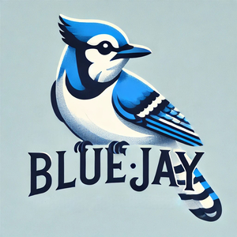
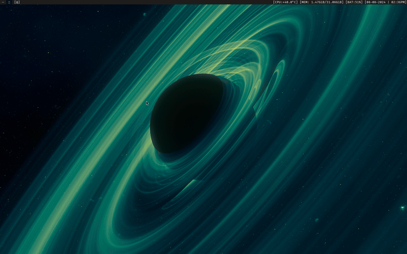
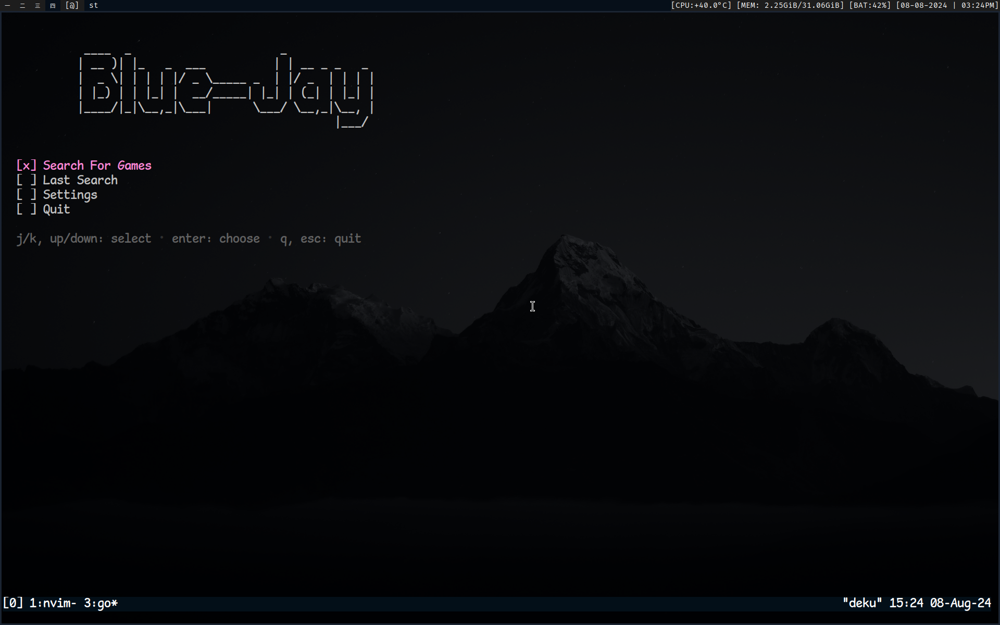
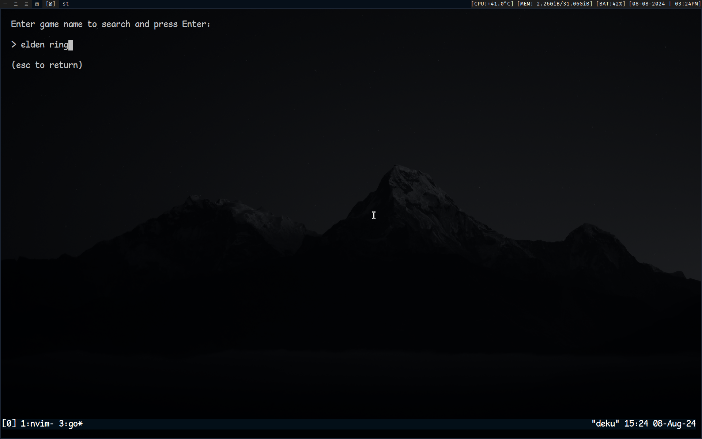
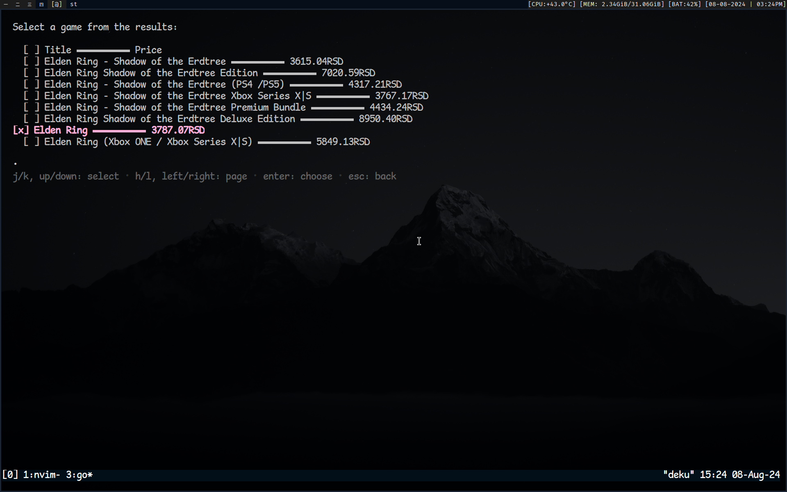

# Blue-Jay

<div align="center">
    
</div>

<i>Minimalistic TUI for video game scraping written in Go.</i>




## Table of Contents

- [Features](#features)
- [Installation](#installation)
  - [Golang Installation](#golang-installation)
  - [Installation on Arch Linux](#installation-on-arch-linux)
- [Usage](#usage)
  - [Navigation](#navigation)
- [Development](#development)
  - [Clone Repository](#clone-repository)
  - [Submitting Changes](#submitting-changes)
- [Gallery](#gallery)
- [Contributing](#contributing)
- [License](#license)
- [Acknowledgments](#acknowledgments)

## Features

- **Minimalistic TUI:** Designed with a clean and intuitive user interface for easy navigation.
- **Game Search:** Search for video games.
- **Scraping Engine:** Utilizes the Colly library to scrape game data from multiple sources.
- **Cross-Platform Support:** Compatible with Linux, Windows, and macOS.
- **Pagination:** Efficiently navigate through search results with paging support.

## Installation

### Golang Installation

To build and run Blue-Jay, you need to have Golang installed on your machine. You can download and install Go from the [official website](https://golang.org/dl/).

1. **Verify Installation:**

   After installing Go, verify the installation by running:

   ```bash
   go version
   ```

   Ensure it outputs the installed version of Go.

2. **Setup GOPATH:**

   Make sure to set up your `GOPATH` environment variable as per the instructions on the Go website.

### Installation on Arch Linux

For Arch Linux users, you can install Blue-Jay using the `bjt` binary:

```bash
yay -S blue-jay
```

Alternatively, you can build it from the source by following the development instructions.

### Libraries Used

- [Bubble Tea](https://github.com/charmbracelet/bubbletea): A powerful TUI framework for Go.
- [Colly](https://github.com/gocolly/colly): A lightning-fast and elegant web scraping library for Go.

## Usage

### Navigation

- **Launch Application:** Start Blue-Jay by running the following command:

  ```bash
  bjt
  ```

- **Main Menu:**
  - Use the `j/k` keys or arrow keys to navigate the menu options.
  - Press `Enter` to select an option.

- **Search:**
  - Enter a search term and press `Enter` to find games.
  - Use `j/k` to scroll through results and `h/l` to switch pages.

- **Open Game Details:**
  - Select a game from the search results and press `Enter` to view more details in your browser.

## Development

To contribute to Blue-Jay, follow these steps:

### Clone Repository

1. **Fork the Repository:**

   Click the "Fork" button on the top right of the [repository page](https://github.com/duolok/blue-jay).

2. **Clone Your Fork:**

   Clone your forked repository to your local machine:

   ```bash
   git clone https://github.com/yourusername/blue-jay.git
   cd blue-jay
   ```

### Submitting Changes

1. **Create a Branch:**

   Create a new branch for your changes:

   ```bash
   git checkout -b feature-name
   ```

2. **Make Changes:**

   Implement your changes or improvements.

3. **Commit and Push:**

   Commit your changes and push them to your forked repository:

   ```bash
   git add .
   git commit -m "Add feature or fix bug"
   git push origin feature-name
   ```

4. **Submit a Pull Request:**

   Go to the original repository and click "Compare & pull request" to submit your changes for review.

## Gallery

Below are some screenshots showcasing Blue-Jay's TUI and features:







## Contributing

Contributions are welcome! Please read our [contributing guidelines](CONTRIBUTING.md) for more information on how to contribute to Blue-Jay.

## License

This project is licensed under the MIT License. See the [LICENSE](LICENSE) file for more details.

